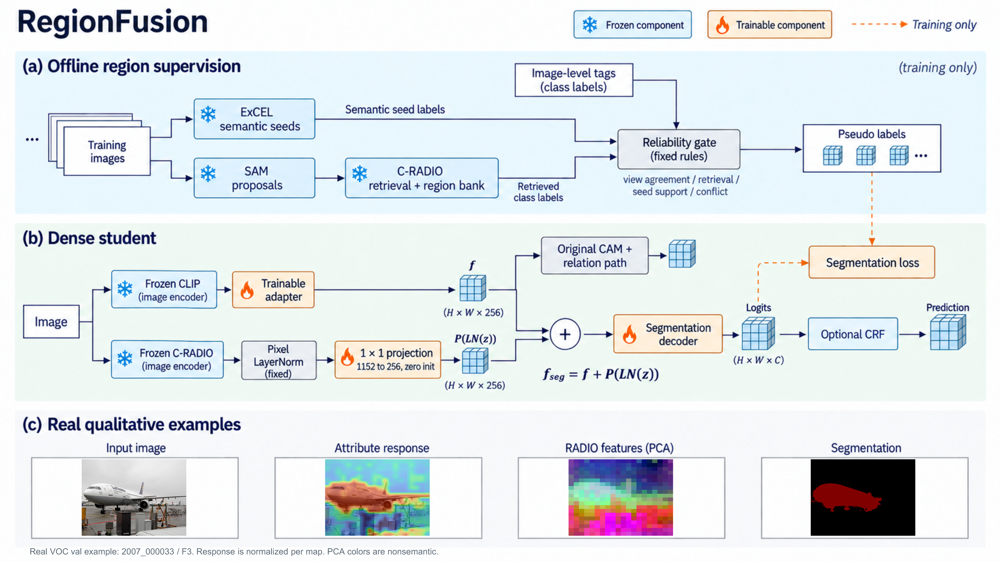
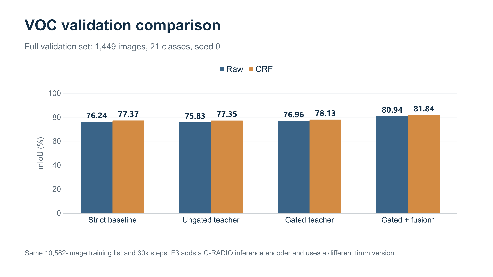
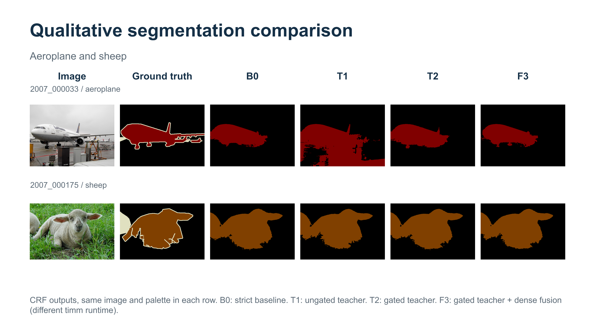
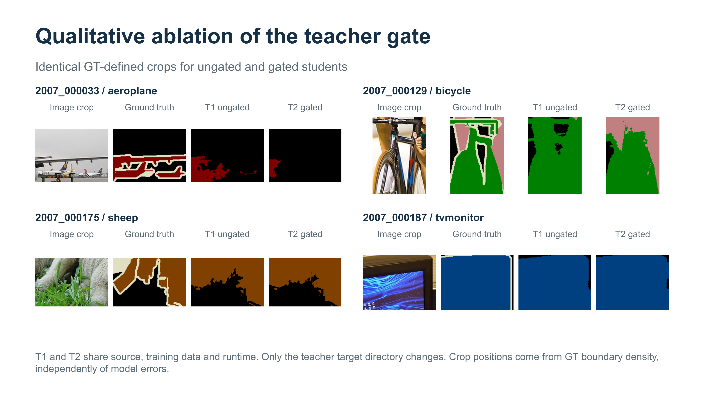
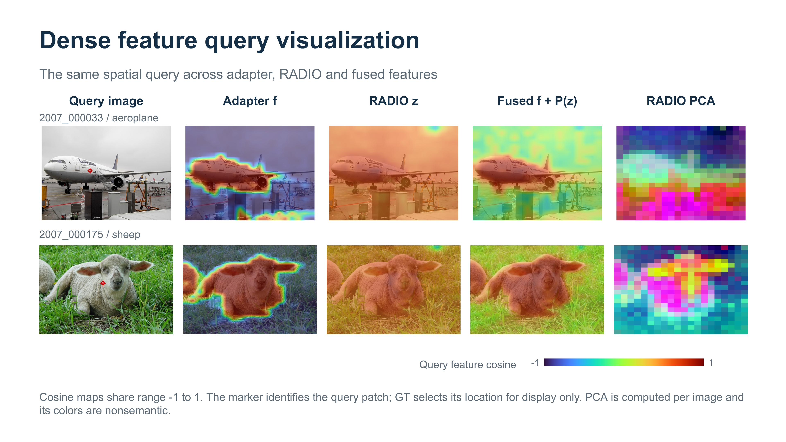

# RegionFusion

**Reliability-gated region supervision and frozen dense feature fusion for weakly supervised semantic segmentation.**

RegionFusion builds on ExCEL with offline region pseudo labels and a frozen C-RADIO feature branch. A zero-initialized projection fuses dense visual features into the segmentation decoder while preserving the original CAM and relation paths.

[Results](#results) · [Visualizations](#visualizations) · [Installation](#installation) · [Data and weights](#data-and-weights) · [Training and evaluation](#training-and-evaluation)



## Method

1. **Region supervision.** Semantic seeds, SAM proposals and C-RADIO region retrieval supply offline pseudo labels. Fixed gates check image tags, agreement between original and flipped views, retrieval confidence, seed support and foreground conflict.
2. **Dense feature fusion.** Frozen C-RADIO features are normalized per pixel and projected from 1,152 to 256 channels with a zero-initialized 1×1 convolution.
3. **Student learning.** The segmentation decoder consumes fused features. The original attribute/CAM and relation branches retain the adapter features. CRF is used as an optional evaluation post-processing step.

$$f_{\mathrm{seg}} = f + P(\mathrm{LN}(z)), \qquad \mathcal{L} = \mathcal{L}_{\mathrm{seg}} + 0.1\mathcal{L}_{\mathrm{aff}}.$$

The projection adds **295,168 trainable parameters**. The frozen C-RADIO encoder is also required at inference. [Implementation and release scope](docs/REPRODUCIBILITY.md) describe the supplied components and external teacher targets.

## Results

PASCAL VOC 2012: **10,582 training images**, **1,449 validation images**, **30,000 training iterations**, batch size **4**, seed **0**. Values are mIoU (%); Raw uses multiscale inference before CRF.

| Configuration | Raw | + CRF |
| :--- | ---: | ---: |
| B0 — strict ExCEL baseline | 76.24 | 77.37 |
| T1 — ungated region teacher | 75.83 | 77.35 |
| T2 — gated region teacher | 76.96 | 78.13 |
| **F3 — gated teacher + dense fusion** | **80.94** | **81.84** |



These are recorded single-seed results from the supplied experiment artifacts, with [full-precision values](docs/results.json). F3 adds external C-RADIO pretraining and an inference encoder, and uses timm 1.0.22; B0/T1/T2 used timm 0.6.12. The comparison measures these system configurations together. The released model implements F3; historical baseline variants and trained checkpoints are not bundled.

Full-list COCO training/evaluation entry points are included (82,081 training / 40,137 validation images). A completed full-list COCO result is not available in the supplied artifacts; earlier COCO subset experiments are not presented as full-dataset results.

## Visualizations

### Segmentation examples

The same VOC images are shown with ground truth and the B0/T1/T2/F3 CRF predictions. Pale ground-truth pixels are ignored labels. The examples show object coverage as well as remaining errors.



### Teacher gate ablation

T1 and T2 use the same student implementation, training data and runtime, with different offline teacher targets. Crops were chosen by ground-truth boundary density for display, independently of model errors. This comparison evaluates the complete gate bundle.



### Dense feature analysis

Query-to-pixel cosine maps share a −1 to 1 scale. Query locations are selected for visualization only; ground truth is not provided to the model. PCA colors represent feature variation rather than semantic classes. Here the displayed RADIO features are already normalized.



All five images are supplied as 3840×2160 PNGs in [Figures](Figures). [Figure notes](Figures/README.md) document their provenance and interpretation.

## Installation

Use **Linux, an NVIDIA CUDA GPU, Python 3.11 and Git**. The source environment used Python 3.11.12, PyTorch 2.9.1, torchvision 0.24.1, CUDA 12.8, timm 1.0.22 and NumPy 1.26.4.

```bash
git clone https://github.com/albert-jin/RegionFusion.git
cd RegionFusion
python3.11 -m venv .venv
source .venv/bin/activate
python -m pip install --upgrade pip
python -m pip install torch==2.9.1 torchvision==0.24.1 --index-url https://download.pytorch.org/whl/cu128
python -m pip install -r requirements.txt
```

[requirements.txt](requirements.txt) lists the student dependencies. The original [environment snapshot](environment/requirements_frozen.txt) is retained for version reference; it also contains host/Jupyter packages and is not a portable installation file. Dependency installation and GPU runs have not been re-executed for this repository packaging.

## Data and weights

Dataset images, pixel masks, offline teacher targets and model weights must be supplied separately. Split lists, image-level labels, text attributes, model configuration and tokenizer vocabulary are included.

```text
/path/to/shared/
├── ViT-B-16.pt
├── region_teacher/
│   └── C_RADIOv4_SO400M.safetensors
├── VOCdevkit/VOC2012/
│   ├── JPEGImages/*.jpg
│   └── SegmentationClassAug/*.png
└── COCO2014/
    ├── JPEGImages/train/*.jpg
    ├── JPEGImages/val/*.jpg
    └── SegmentationClass/val/*.png
```

Teacher masks live in a separate directory as `<image_id>.png` and must cover the complete training list. Use class indices 0–20 for VOC and 0–80 for COCO, with 255 for ignored pixels. Teacher masks are model-generated targets; training ground-truth segmentation masks are not a substitute.

```bash
# Run from the repository root; replace all /path/to/... placeholders.
export ROOT="$PWD"
export SHARED=/path/to/shared
python package_tools/prepare.py --shared "$SHARED"
export EXCEL_CLIP_CACHE="$SHARED"
export OMP_NUM_THREADS=4 MKL_NUM_THREADS=4 OPENBLAS_NUM_THREADS=4
export PYTHONUNBUFFERED=1
cd "$ROOT/RegionFusion"
```

The preparation tool verifies the shipped source manifest and creates the `shared` link. It does not launch a model. The C-RADIO loader checks the expected weight SHA-256; see [asset details](docs/REPRODUCIBILITY.md#external-assets). Pretrained encoders remain necessary when loading a trained student checkpoint. Attribute embedding caches are generated on first use from the included descriptors.

## Training and evaluation

The commands below run from `$ROOT/RegionFusion` after asset preparation. Training and validation create timestamped directories under `$ROOT/outputs/` containing configuration, source fingerprints, logs, metrics and checkpoints.

### PASCAL VOC

```bash
export VOC_DATA="$SHARED/VOCdevkit/VOC2012"
export VOC_TEACHER=/path/to/teachers/voc/pseudo

python experiments/voc/train_recorded.py \
  --data "$VOC_DATA" --teacher-dir "$VOC_TEACHER" \
  --iters 30000 --seed 0 --tag regionfusion_voc_train

python experiments/voc/evaluate_seg.py \
  --data "$VOC_DATA" --checkpoint /path/to/regionfusion_voc.pth \
  --tag regionfusion_voc_val
```

The final evaluation command uses all 1,449 validation images. `--limit N` is available for a partial sanity check. Inference uses scales 0.7, 1.0, 1.2 and 1.5 from a 320×320 base, with the inherited VOC flip protocol; image-level tags are not used to mask predictions.

### COCO

Configure each new run to verify the complete dataset and establish fresh wall-clock limits:

```bash
export COCO_DATA="$SHARED/COCO2014"
export COCO_TEACHER=/path/to/teachers/coco/pseudo

python "$ROOT/package_tools/configure_coco.py" \
  --mode train --data "$COCO_DATA" --teacher-dir "$COCO_TEACHER" \
  --iters 100000 --train-hours 168 --eval-hours 168
python experiments/coco/train_coco.py \
  --data "$COCO_DATA" --teacher-dir "$COCO_TEACHER" \
  --iters 100000 --seed 0 --tag regionfusion_coco_train

python "$ROOT/package_tools/configure_coco.py" \
  --mode eval --data "$COCO_DATA" --eval-hours 168
python experiments/coco/evaluate_coco.py \
  --data "$COCO_DATA" --checkpoint /path/to/regionfusion_coco.pth \
  --tag regionfusion_coco_val
```

Keep `--iters` consistent between configuration and training. The COCO evaluation path averages flips at all four scales and aggregates logits at 0.2× the original spatial resolution before upsampling and CRF.

### Key settings

| Setting | VOC | COCO |
| :--- | :--- | :--- |
| Classes, including background | 21 | 81 |
| Batch size / crop | 4 / 320×320 | 4 / 320×320 |
| Iterations | 30,000 | 100,000 |
| Optimizer / learning rate | PolyWarmupAdamW / 1e−4 | PolyWarmupAdamW / 1e−4 |
| Weight decay / affinity loss weight | 0.01 / 0.1 | 0.01 / 0.1 |
| Warmup iterations | 50 | 200 |
| Attribute refinement starts at zero-based iteration | 14,000 | 30,000 |
| Student relation targets start at zero-based iteration | 24,000 | 80,000 |

## Repository layout

```text
RegionFusion/
├── RegionFusion/
│   ├── model/                 # Dense fusion, decoder and losses
│   ├── clip/                  # ExCEL CLIP implementation and vocabulary
│   ├── datasets/              # Loaders, complete splits and image-level labels
│   ├── attributes_text/       # VOC and COCO attribute descriptors
│   ├── engine/                # Network, optimizer and validation builders
│   ├── scripts/train_voc.py   # Distributed VOC training loop
│   ├── experiments/voc/       # VOC training and final evaluation entry points
│   ├── experiments/coco/      # COCO training and final evaluation entry points
│   └── utils/
├── ModuSeg_runtime/           # Required C-RADIO and OpenCLIP runtime sources
├── package_tools/            # Asset preparation and COCO setup
├── configs/                  # Dataset manifest and source checksums
├── Figures/                  # Five original 4K figures
├── docs/                     # Reproduction notes and numeric results
├── environment/              # Original dependency snapshot
└── requirements.txt
```

Automatic search, internal checkpoint review control, machine-specific helpers, generated outputs and unrelated upstream pipelines are excluded from this release. [Release notes](docs/RELEASE_NOTES.md) list the packaging changes.

## Acknowledgments

RegionFusion builds on ExCEL, CLIP, C-RADIO and OpenCLIP; the offline method also uses SAM proposals. Original source headers and the bundled runtime license are retained. See [third-party notices](THIRD_PARTY_NOTICES.md).
